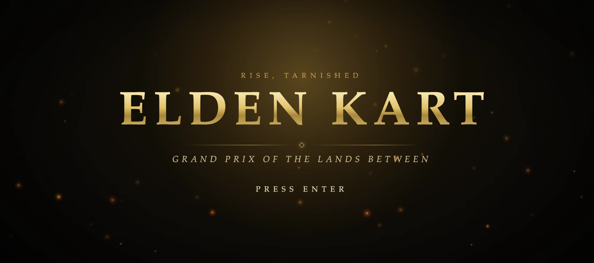

# Elden Kart



An arcade kart racer set in a world inspired by the Lands Between, built with [three.js](https://threejs.org/) and [Vite](https://vite.dev/). It has eight racers, four circuits, ten items and a Grand Prix mode. All graphics and audio are procedural.

> **Unofficial, non-commercial fan project** made for learning and testing purposes. It is not affiliated with, endorsed, or sponsored by FromSoftware, Bandai Namco Entertainment, or Nintendo. See [DISCLAIMER.md](DISCLAIMER.md).

This project is 100% made by Claude Code (Sonnet 5.5), just for fun.  
Original idea by [Timisageek on Reddit](https://www.reddit.com/r/ClaudeCode/comments/1wsx03y/sonnet_55_high_oneshot_a_full_mario_kart_from_1/).

## Getting started

You need [Node.js](https://nodejs.org/) 24 (pinned in `.nvmrc`) and [pnpm](https://pnpm.io/) (version pinned in `package.json`).

```bash
nvm use          # or: fnm use
corepack enable  # once, installs the pinned pnpm version
pnpm install
pnpm dev
```

Then open <http://localhost:5173>.

| Command        | What it does                                       |
| -------------- | -------------------------------------------------- |
| `pnpm dev`     | Starts the dev server with hot reload on port 5173 |
| `pnpm build`   | Builds the production bundle into `dist/`          |
| `pnpm preview` | Serves the production build on port 4173           |
| `pnpm lint`    | Lints the JavaScript with ESLint                   |
| `pnpm format`  | Formats code and docs with Prettier                |

## How to play

From the main menu, pick a mode:

- **Grand Prix**: the four circuits in a row against the same seven rivals. Each race awards points (15, 12, 10, 8, 6, 4, 2, 1) and the totals decide the final ranking.
- **Quick Race**: a single circuit of your choice.
- **Settings**: master, music and effects volume, and graphics quality (Low, Medium, High). Settings are saved in the browser.

Before racing, choose an engine class. It sets the speed of every kart and the skill of your rivals:

| Class | Speed       | Rivals      |
| ----- | ----------- | ----------- |
| 100cc | Slower      | Relaxed     |
| 150cc | Standard    | Competitive |
| 200cc | Much faster | Ruthless    |

### Controls

| Action                      | Keyboard         | Gamepad             |
| --------------------------- | ---------------- | ------------------- |
| Accelerate                  | W or ↑           | A or RT             |
| Brake / reverse             | S or ↓           | B or LT             |
| Steer                       | A D or ← →       | Left stick or D-pad |
| Drift (hold while steering) | Space            | LB or RB            |
| Use item                    | E, Shift or Ctrl | X                   |
| Look behind                 | C or B           | Y                   |
| Pause                       | Esc or P         | Start               |
| Back on track               | R                | View / Back         |

In menus, use the arrow keys or WASD to move, Enter to confirm and Esc to go back.

Tips:

- Hold a drift to charge blue, then orange, then purple sparks. Release it for a mini-turbo.
- Press accelerate within the last 0.7 s before GO for a rocket start.
- Hold brake while using an item to throw or drop it behind you.

### Items

| Item               | Effect                                                      |
| ------------------ | ----------------------------------------------------------- |
| Crimson Flask      | Short speed boost                                           |
| Golden Rune        | Three short boosts                                          |
| Rot Pot            | Lobbed ahead, or dropped behind, and leaves a poison puddle |
| Fire Pot           | Bouncing firebomb that explodes on contact                  |
| Glintstone Missile | Homes in on the racer ahead                                 |
| Black Knife        | Seeks out the race leader                                   |
| Erdtree Blessing   | Invincibility and speed                                     |
| Bloodhound Step    | Short invulnerable dash                                     |
| Stonesword Key     | Shield that blocks one hit                                  |
| Torrent's Call     | Long boost with a spectral steed                            |

## Development

Skip the menus and jump straight into a Quick Race:

```
http://localhost:5173/?track=caelid&char=ranni&class=200cc
```

- **Tracks**: `limgrave`, `caelid`, `leyndell`, `haligtree`
- **Characters**: `tarnished`, `ranni`, `malenia`, `radahn`, `melina`, `blaidd`, `patches`, `godrick`
- **Classes**: `100cc`, `150cc`, `200cc`

The dev server also serves standalone sandboxes:

| Page                 | Purpose                                                                                                 |
| -------------------- | ------------------------------------------------------------------------------------------------------- |
| `/model-viewer.html` | All kart and driver models on a turntable. `?solo=<character>&view=front\|side\|rear\|q` for a close-up |
| `/track-viewer.html` | Fly-through of a circuit. `?track=<id>&mode=fly\|chase\|top\|free`                                      |
| `/fx-viewer.html`    | Items and particle effects on a test ring                                                               |
| `/ui-viewer.html`    | Menus, HUD and audio with fake data                                                                     |

`node src/track/check.mjs` runs numeric checks on the four circuit layouts: no self-intersection, smooth sampling, and a valid starting grid.

Every game asset is generated at runtime. The only binary file in the repository is the README banner:

- Models are built from three.js primitives.
- Textures are drawn on canvas.
- Music and sound effects are synthesized with the Web Audio API.

### Project structure

| Path        | Contents                                                                  |
| ----------- | ------------------------------------------------------------------------- |
| `src/core`  | Game loop, input, camera, race rules, settings, shared data and event bus |
| `src/track` | Circuit generation: centreline, road, terrain, sky and scenery            |
| `src/karts` | Kart physics and procedural kart and driver models                        |
| `src/ai`    | AI drivers                                                                |
| `src/items` | Item boxes and the ten items                                              |
| `src/fx`    | Particles and post-processing                                             |
| `src/ui`    | Menus, HUD and procedural UI art                                          |
| `src/audio` | Procedural music and sound effects                                        |

See [ARCHITECTURE.md](ARCHITECTURE.md) for module contracts and conventions.

## License

The original source code is released under the [MIT License](LICENSE).

This license covers only the code written for this project. It grants no rights over any third-party name, character or trademark (see [DISCLAIMER.md](DISCLAIMER.md)). Dependencies such as three.js and Vite are distributed under their own licenses.
